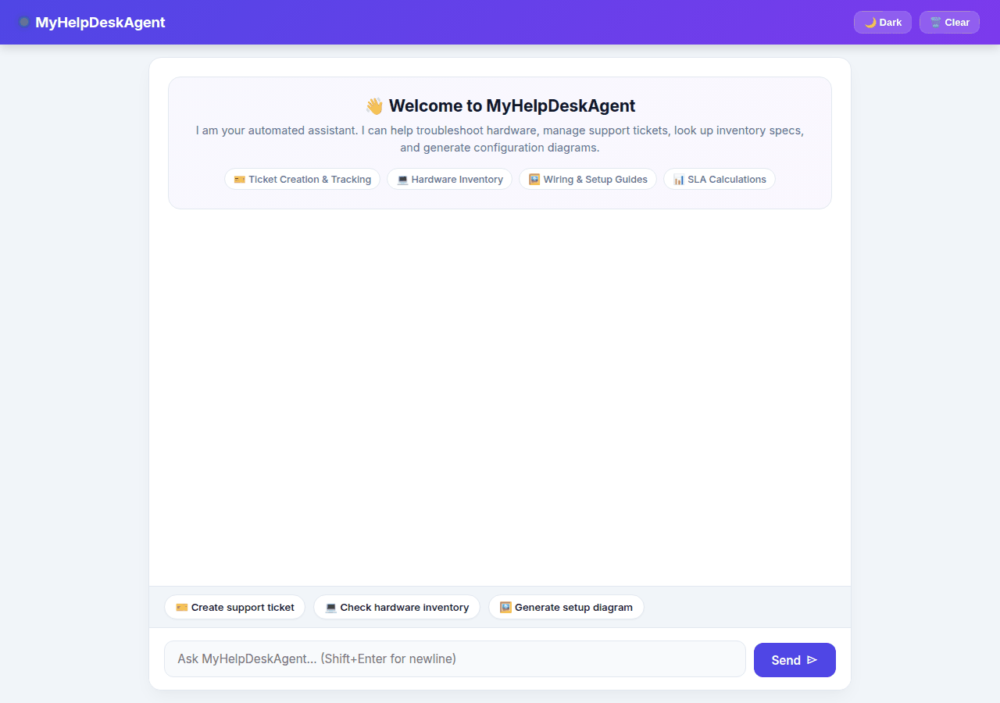

# MyHelpDeskAgent

[](https://www.python.org/)
[](https://google.github.io/agent-development-kit/)
[](https://frontend-246073422784.us-east1.run.app)
[](LICENSE)

> 🌐 **Live Deployed Web Application**: [https://frontend-246073422784.us-east1.run.app](https://frontend-246073422784.us-east1.run.app)

**MyHelpDeskAgent** is an AI-powered IT Helpdesk & Support assistant built with Google's **Agent Development Kit (ADK v1.1.0)**. It assists employees with IT support ticketing, hardware inventory lookup, network diagnostics, multimodal setup guide generation (diagrams & videos), and SLA calculation metrics—all presented through rich **A2UI card surfaces** and backed by cross-session **Vertex AI Memory Bank**.



---

## 📚 Technical Documentation Suite

| Document | Focus & Description |
| :--- | :--- |
| 🏗️ **[Architecture Guide](doc/architecture.md)** | System overview, GCP service integrations, A2A protocol flow, and security boundaries. |
| 🎨 **[Design Patterns](doc/design_patterns.md)** | ReAct loop, Proxy/Gateway, Callback interceptors, Factory/Schema Manager, and Dual Storage patterns. |
| 📂 **[Code Structure & DB Schemas](doc/code_structure.md)** | Module layout, complete tool reference matrix, and Firestore collection schemas (`tickets`, `hardware`). |
| 🔄 **[Data Flow Sequences](doc/data_flow.md)** | End-to-end user interaction sequence diagrams, multimodal pipelines, and Memory Bank persistence. |

---

## 🛠️ Implemented Capabilities & Architecture

All features listed below are directly implemented and verified in `app/agent.py`, `app/a2ui_utils.py`, and `agents-cli-manifest.yaml`.

### 🧠 Cross-Session Long-Term Memory
- **Vertex AI Memory Bank**: Integrated using `VertexAiMemoryBankService` (Location: `us-east1`).
- **Memory Retrieval**: Uses `PreloadMemoryTool` to load past user preferences, dietary notes, or hardware choices into model context.
- **Memory Extraction Callback**: Automatically extracts and persists user preferences after each turn via `generate_memories_callback`.

### 📊 Database & Inventory (Google Cloud Firestore)
- **Hardware Inventory Lookup** (`get_hardware_info`): Queries Firestore `hardware` collection for assigned laptops, serial numbers, and device specifications by Asset ID (`HW-xxxx`) or employee name.
- **Support Ticket Creation** (`create_ticket`): Generates and stores new IT support tickets in the Firestore `tickets` collection with category, priority, and ticket ID (`TCK-xxxx`).
- **Ticket Status & Details** (`get_ticket_status`): Fetches complete ticket resolution status and details by ticket ID.
- **Employee Ticket History** (`list_user_tickets`): Streams all open and past support requests submitted by a specific user.
- **Ticket Updates** (`update_ticket_status`): Modifies ticket status (`Open`, `In Progress`, `Resolved`, `Closed`) and appends resolution notes.

### 🖼️ Multimodal Visual & Video Generation
- **Technical Setup Diagrams** (`generate_setup_guide_image`): Uses Google Gen AI (`gemini-3.1-flash-lite-image`) to create technical troubleshooting diagrams.
- **Hardware Demonstration Videos** (`generate_hardware_video`): Uses Google's Omni model (`gemini-omni-flash-preview` in `global` region) to produce short video demonstrations.
- **Cloud Media Storage**: Uploads generated images and video bytes directly to a public **Google Cloud Storage** bucket and returns public HTTPS URLs (`https://storage.googleapis.com/...`).
- **Playground Artifact Integration**: Uses `tool_context.save_artifact` to render generated media within the ADK Playground Artifacts panel.

### 🌐 Diagnostics & Code Sandbox Execution
- **IP Network Geolocation** (`lookup_ip_address`): Performs network diagnostics (ISP, organization, location, ASN) for troubleshooting IP connectivity issues.
- **Python Sandbox Code Execution**: Uses `AgentEngineSandboxCodeExecutor` (`calculate`) to evaluate SLA metrics and hardware depreciation equations in a secure sandbox environment.

### 🎨 Rich A2UI Surface Rendering
- **A2UI Catalog Integration**: Built with `A2uiSchemaManager` (v0.8) and `a2ui_callback`.
- **Supported Surface Components**: Formats agent outputs into flat UI cards using `Card`, `Column`, `Row`, `Text`, and `Image` components.

---

## 📋 Status of Planned Features

| Feature | Status | Notes |
| :--- | :---: | :--- |
| **Firestore Ticket & Hardware Management** | ✅ Implemented | Live CRUD operations on Firestore `tickets` and `hardware` collections |
| **Vertex AI Memory Bank** | ✅ Implemented | Active cross-session memory extraction & preloading |
| **GCS Asset Hosting** | ✅ Implemented | Public GCS uploads for generated images and videos |
| **Imagen & Omni Video Generation** | ✅ Implemented | Live `gemini-3.1-flash-lite-image` and `gemini-omni-flash-preview` tools |
| **Custom FastAPI Proxy & A2UI Frontend** | ✅ Implemented | Browser -> FastAPI proxy -> Agent via A2A protocol |
| **External ITSM Sync (Jira / ServiceNow)** | ⏳ *Planned, not implemented* | Out of scope for current agent build |
| **Automated Email Notifications** | ⏳ *Planned, not implemented* | Out of scope for current agent build |

---

## 📁 Repository Structure

```
it-helpdesk-agent/
├── app/
│   ├── agent.py               # Core ADK agent, tools, Firestore DB, and Memory Bank wiring
│   ├── a2ui_utils.py          # A2UI response formatting callback
│   └── fast_api_app.py        # ADK FastAPI backend server
├── frontend/
│   ├── main.py                # FastAPI proxy server (A2A protocol bridge)
│   └── static/
│       └── index.html         # Custom frontend chat interface with A2UI renderer
├── doc/                        # Detailed Technical & Architecture Docs
│   ├── architecture.md         # System architecture & GCP integration
│   ├── design_patterns.md      # Software & AI design patterns
│   ├── code_structure.md       # Directory layout, tools & DB schema
│   └── data_flow.md            # Sequence diagrams & end-to-end data flows
├── agents-cli-manifest.yaml   # Manifest configuration (A2A mode, region, agent directory)
├── pyproject.toml             # Python dependencies and uv project settings
└── deployment_metadata.json   # Deployed Agent Runtime resource metadata
```

---

## 💻 Step-by-Step Local Setup & Execution

Follow these step-by-step instructions to run **MyHelpDeskAgent** locally on your workstation.

### 📋 Prerequisites
- **Python**: Version `3.11` (or `3.12`)
- **Google Cloud SDK (`gcloud`)**: Installed and authenticated
- **Git**: Installed

---

### 1️⃣ Step 1: Clone the Repository
```bash
git clone https://github.com/PuneetShivaay/buildwithgemini-MyHelpDeskAgent.git
cd buildwithgemini-MyHelpDeskAgent
```

---

### 2️⃣ Step 2: Authenticate with Google Cloud
Ensure Application Default Credentials (ADC) are configured so the agent can access Vertex AI Memory Bank, Firestore, and GCS:

```bash
# Login to Google Cloud CLI
gcloud auth login

# Configure Application Default Credentials
gcloud auth application-default login

# Set your active GCP project ID
gcloud config set project <YOUR_GCP_PROJECT_ID>
```

---

### 3️⃣ Step 3: Create & Activate Virtual Environment
```bash
# Create Python virtual environment
python3 -m venv .venv

# Activate virtual environment
source .venv/bin/activate  # Windows: .venv\Scripts\activate

# Upgrade pip & install project dependencies
pip install --upgrade pip
pip install -r requirements.txt
```

---

### 4️⃣ Step 4: Launch ADK Local Web Playground
Start the ADK Developer Web server to test tools, Memory Bank, and A2UI card outputs locally:

```bash
adk web --port 18080 .
```
Open **`http://localhost:18080`** in your browser to interact directly with the agent tools in the ADK Developer UI.

---

### 5️⃣ Step 5: Launch Full Web Application & Landing Page
In a **second terminal window**, activate your virtual environment and start the FastAPI proxy:

```bash
cd frontend

# Set environment variables
export AGENT_ENGINE_RESOURCE_NAME="projects/<PROJECT_NUMBER>/locations/us-east1/reasoningEngines/<ENGINE_ID>"
export AGENT_DIRECTORY="app"
export PORT=8080

# Run Uvicorn server
python main.py
```

Open **`http://localhost:8080`** in your browser to experience the **Home Overview Landing Page**, **Live Chat Assistant**, and **Documentation Suite**!

---

## 🚀 Cloud Deployment

To deploy the agent backend to **Vertex AI Agent Runtime**:
```bash
gcloud config set project <PROJECT_ID>
agents-cli deploy
```

To deploy the custom frontend proxy to **Google Cloud Run**:
```bash
cd frontend
gcloud run deploy frontend \
  --source . \
  --region us-east1 \
  --project <PROJECT_ID> \
  --allow-unauthenticated \
  --set-env-vars AGENT_ENGINE_RESOURCE_NAME="<REMOTE_RESOURCE_ID>",AGENT_DIRECTORY="app"
```
